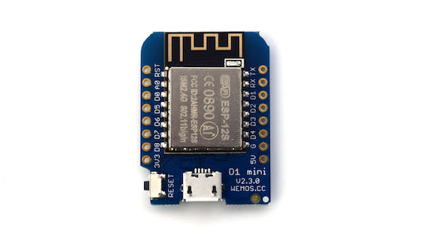
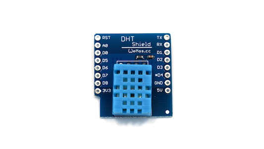

# iot-demo

## Descripción del problema

En cada aula del instituto vamos a tener un [Wemos D1 mini][4] y un [sensor de temperatura/humedad DHT11][5] que va a ir tomando medidas de forma constante y las va a ir publicando en un [*broker* MQTT][2]. También existirán otros dispositivos y aplicaciones que estarán suscritas a los *topics* del [*broker* MQTT][2] donde se publican los valores recogidos por los sensores. Podríamos seguir la siguiente estructura de nombres para los *topics* del edificio:

```
ies/aula<número>/temperature
ies/aula<número>/humidity
```

Por ejemplo para el `aula20` tendríamos los siguientes *topics*:

```
ies/aula20/temperature
ies/aula20/humidity
```

## Wemos D1 mini



Puedes encontrar [más información en la documentación oficial][4].

## Sensor de temperatura/humedad DHT11



Puedes encontrar [más información en la documentación oficial][6].

## Cómo obtener la dirección MAC de un Wemos D1 mini

En las aulas estamos usando filtrado por MAC, por lo que será necesario conocer la dirección MAC de nuestros dispositivos [Wemos D1 mini][4]. Podemos usar el siguiente código de ejemplo:

```c++
#include <ESP8266WiFi.h>
 
void setup() {
    delay(500);
    Serial.begin(115200);
    Serial.print("MAC: ");
    Serial.println(WiFi.macAddress());
}
 
void loop() {

}
```

## MQTT *broker*

### Instalación

Vamos a instalar [mosquitto][1], un  *broker* [MQTT][2] *open source* usado para la comunicación entre dispositivos en el [IoT][3].

```bash
sudo apt-get install -y mosquitto mosquitto-clients
```

### Configuración

Configuramos [mosquitto][1] para que acepte conexiones de red desde cualquier interfaz del servidor. Editamos el archivo:

```
/etc/mosquitto/mosquitto.conf 
```

y añadimos la siguiente línea:

```
bind_address 0.0.0.0
```

### Publicar mensajes en un *topic*

``` 
mosquitto_pub -h <host> -t <topic> -m <mensaje>
```

Por ejemplo, el comando:

``` 
mosquitto_pub -h 192.168.20.21 -t aula20 -m "hello world!"
```

Publica el mensaje `"hello world!"` en el topic `aula20` en el [MQTT][2] *broker* que está en la IP `192.168.20.21`.

### Suscribirse a un *topic* 

```
mosquitto_sub -h <host> -t <topic>
```

Por ejemplo, el comando:

```
mosquitto_sub -h 192.168.1.171 -t aula20
```

Se suscribe al topic `aula20` que está en el [MQTT][2] *broker* con dirección IP `192.168.20.21`.

## Licencia

<a rel="license" href="http://creativecommons.org/licenses/by-sa/4.0/"></a><br />Esta obra está bajo una <a rel="license" href="http://creativecommons.org/licenses/by-sa/4.0/">licencia de Creative Commons Reconocimiento-CompartirIgual 4.0 Internacional</a>.


[1]: https://mosquitto.org
[2]: http://mqtt.org
[3]: https://es.wikipedia.org/wiki/Internet_de_las_cosas
[4]: https://wiki.wemos.cc/products:d1:d1_mini
[5]: https://learn.adafruit.com/dht/overview
[6]: https://wiki.wemos.cc/products:retired:dht_shield_v1.0.0?s[]=temperature